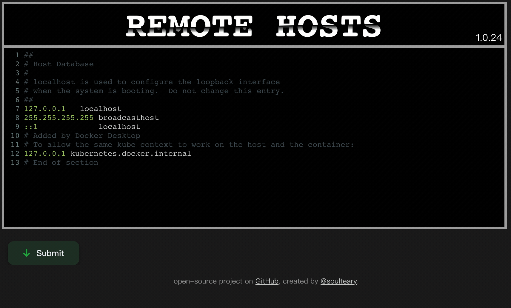
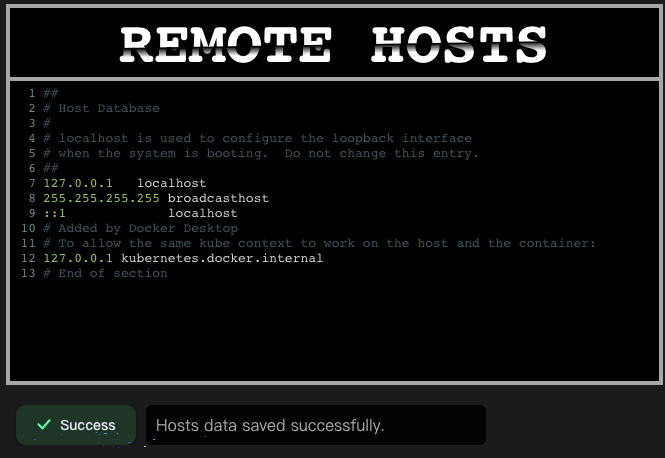
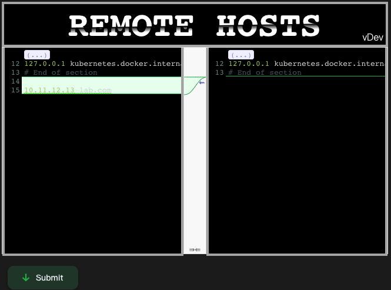
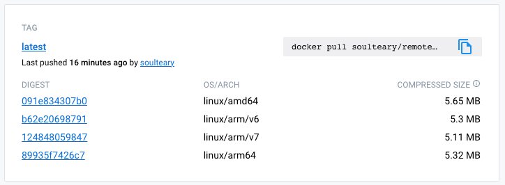

# Remote Hosts Server

[](https://github.com/soulteary/remote-hosts-server/actions/workflows/codeql.yml)

<p style="text-align: center;">
  <a href="README.md" target="_blank">ENGLISH</a> | <a href="README_CN.md">中文文档</a>
</p>

**Tiny (5MB), Muti-Arch (ARM, x86) ,Easy (One Command), Docker Support (ARM, x86)**

Manage and share your Hosts configuration, suitable for tools such as [SwitchHosts](https://github.com/oldj/SwitchHosts).



## Quick Start

Download the binaries from [GitHub Releases page](https://github.com/soulteary/remote-hosts-server/releases), then quickly start a service for sharing Hosts with just one command:

```bash
./remote-hosts-server
```

If you are a Docker user, you can use the following command instead:

```bash
docker run --rm -it -v `pwd`/data:/data -p 8080:8080 soulteary/remote-hosts-server
```

After the program runs, the service will be started on port 8080 by default, the port can be adjusted by setting something like `PORT=8090 ./remote-hosts-server`.

Then open the browser and you will see the interface, Update the Hosts content to your liking, then save it.



The program will intelligently judge whether it needs to be reviewed according to the actual situation,
so as to avoid wrong submission and affect the normal use.



If you always don't want the second confirmation interface, you can add parameters `MODE=simple` (docker `-e "MODE=simple"`) at startup to avoid it.

When we save the HOSTS, we can get the shared Hosts configuration by visiting `http://ip:port/api/hosts` (eg: `http://localhost:8080/api/hosts`)

Fill this address into Switch Hosts, set the appropriate update frequency, click Update Data to verify whether the data can be obtained, and then click OK to automatically update the configuration.


## Docker

- [Docker Hub](https://hub.docker.com/r/soulteary/remote-hosts-server)



If you are used to using Docker Compose, you can refer to the following configuration:

```bash
version: '2'
services:

  remote-hosts-server:
    image: soulteary/remote-hosts-server
    ports:
      - "8080:8080"
    environment:
      # same with ports
      - PORT=8080
      # mode: normal or simple
      - MODE=normal
    volumes:
      - ./data:/data
```

## Resources

- [Gin-Gonic/Gin](https://github.com/gin-gonic/gin)
- [CodeMirror/CodeMirror5](https://github.com/codemirror/codemirror5)
- [Google/Diff-Match-Patch](https://github.com/google/diff-match-patch)
- [CodeMirror Highlight rules for hosts](https://github.com/oldj/SwitchHosts/blob/f595d23e1df8c52062cb12fc4a5c7a90b9e6a637/src/renderer/components/Editor/cm_hl.ts)
- [Madrobby/Zepto](https://github.com/madrobby/zepto)
- Logo inspire by [TajShireen](https://codepen.io/TajShireen/pen/ExLWgGb)
- Button inspire by [coopergoeke](https://codepen.io/coopergoeke/pen/wvaYMbJ)
