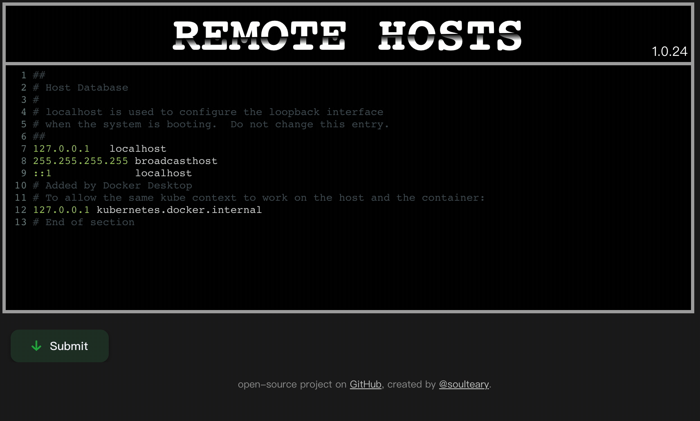
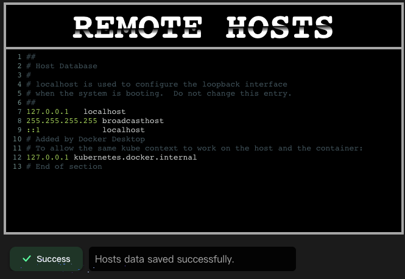
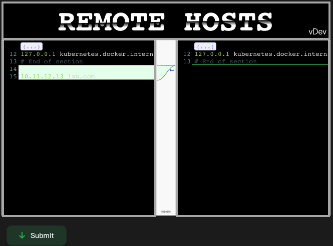
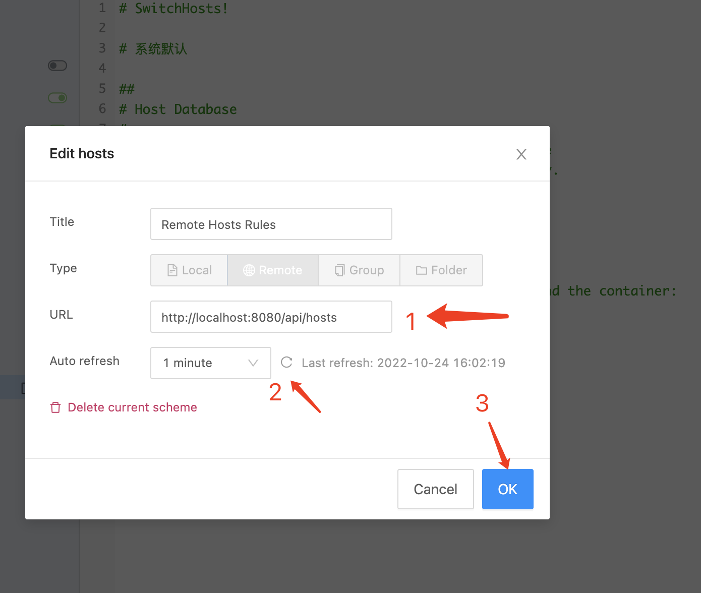

# Remote Hosts Server

[](https://github.com/soulteary/remote-hosts-server/actions/workflows/codeql.yml)

**小巧（5MB）、多 CPU 架构支持、使用简单，支持 Docker（多架构）**

轻松管理和分享你的 Hosts 配置，适用于：[SwitchHosts](https://github.com/oldj/SwitchHosts) 在内的软件。



## 快速上手

从 [GitHub Releases](https://github.com/soulteary/remote-hosts-server/releases) 页面获取适合你运行环境的二进制文件，直接在命令行中执行即可启动服务：

```bash
./remote-hosts-server
```

如果你是 Docker 用户，可以使用下面的命令来快速启动服务：

```bash
docker run --rm -it -v `pwd`/data:/data -p 8080:8080 soulteary/remote-hosts-server
```

程序默认运行在 `8080` 端口，如果你希望调整端口，可以使用 `PORT=8090 ./remote-hosts-server` 来修改端口号。（Docker 的话，可以使用相同方式来修改端口号，也可以使用 `-p 8090:8080` 来调整映射，随你喜好）

打开浏览器，访问 `http://localhost:8080` 将看到支持域名的编辑器界面，根据你的需求调整内容，然后点击保存即可。



程序将会根据实际情况，来做出直接保存内容，或者提示需要人工介入 Review 确认数据变动是否合理，避免影响错误修改导致的使用问题。



如果你不希望出现这个 Review 界面，可以通过添加启动参数 `MODE=simple` (docker 中添加环境变量 `-e "MODE=simple"`) 来避免出现这个界面。

当我们保存完 Hosts 规则之后，可以通过访问 `http://ip:port/api/hosts` 这个地址来获得所有的 Hosts 规则，比如：`http://localhost:8080/api/hosts` 。

将上面的地址填入 Switch Hosts，设置合理的更新时间，然后点击更新数据简单验证接口是否可用，如果没有问题，那么我们点击确认即可。Switch Hosts 将根据设置的数据更新频率，自动的同步和更新我们的 Hosts。



## Docker

- [Docker Hub](https://hub.docker.com/r/soulteary/remote-hosts-server)


## 相关资源

- [Gin-Gonic/Gin](https://github.com/gin-gonic/gin)
- [CodeMirror/CodeMirror5](https://github.com/codemirror/codemirror5)
- [Google/Diff-Match-Patch](https://github.com/google/diff-match-patch)
- [CodeMirror Highlight rules for hosts](https://github.com/oldj/SwitchHosts/blob/f595d23e1df8c52062cb12fc4a5c7a90b9e6a637/src/renderer/components/Editor/cm_hl.ts)
- [Madrobby/Zepto](https://github.com/madrobby/zepto)
- Logo inspire by [TajShireen](https://codepen.io/TajShireen/pen/ExLWgGb)
- Button inspire by [coopergoeke](https://codepen.io/coopergoeke/pen/wvaYMbJ)
